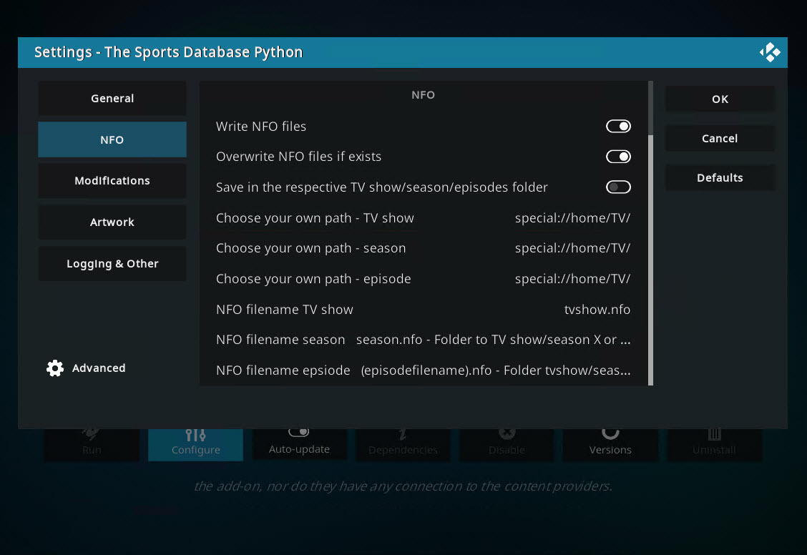
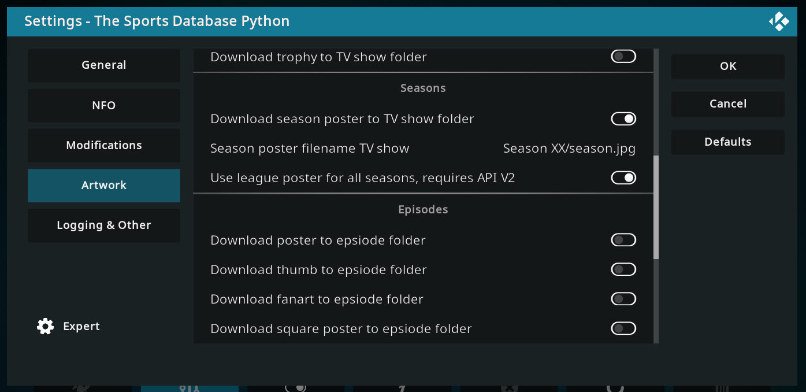
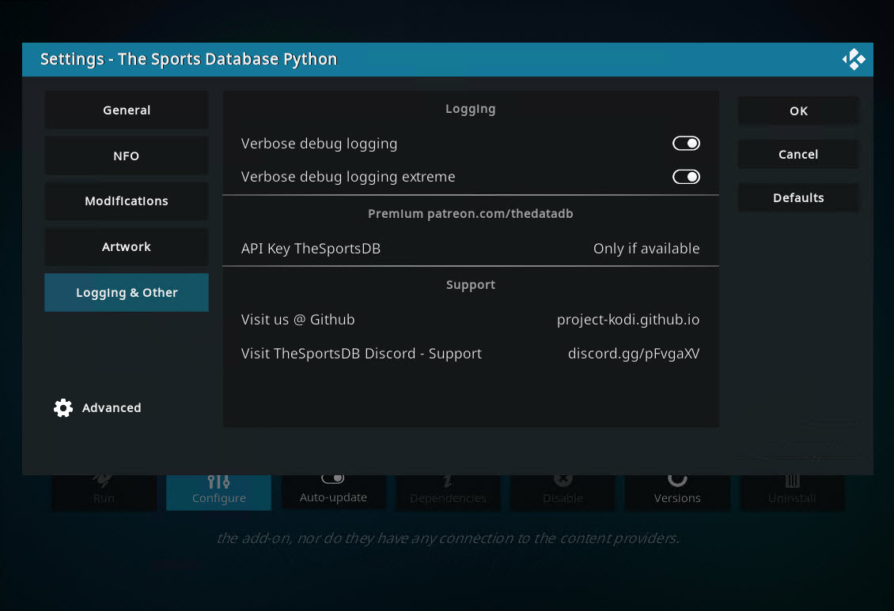
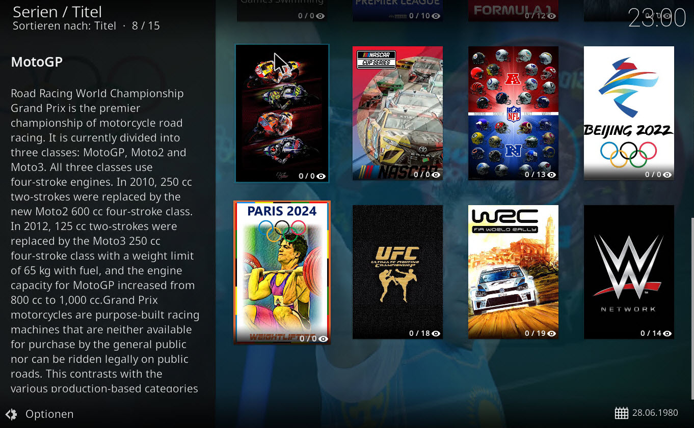
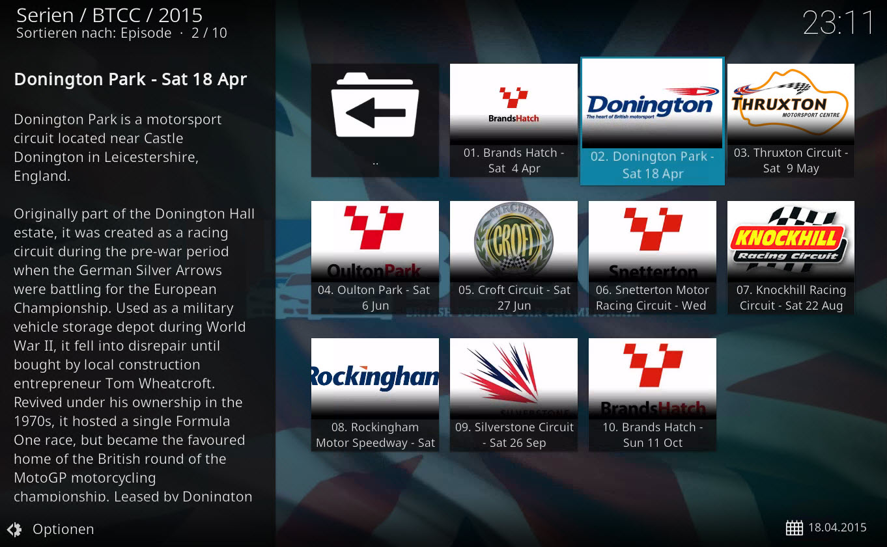
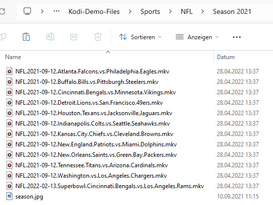

> [!NOTE]
> Support us on Patreon: <a href="https://patreon.com/ProjectKodi">patreon.com/ProjectKodi</a>

# Project Kodi - The Sports Database Pyhton
## metadata.thesportsdb.python

<ul>
    <li>File naming tools for Sports Database: <a href="https://www.tinymediamanager.org/">TinyMediaManager</a> | <a href="https://gitlab.com/tinyMediaManager">TinyMediaManager - Gitlab</a> (and yet not supported: Media Companion, MediaElch, Radarr, Sonarr, Jellyfin,.. help and contact the software manufacturers!)</li>
    <li>Kodi Forum: The Sports Database Pyhton - (metadata.thesportsdb.python): <a href="https://forum.kodi.tv/showthread.php?tid=256198">TheSportsDB Python Scraper (for Nexus and Later)</a></li>
    <li>Download: Use the Project Kodi Repository in Kodi: <a href="https://project-kodi.github.io/">https://project-kodi.github.io/</a></li>
    <li>Download Example Files: <a href="https://raw.githubusercontent.com/Project-Kodi/Project-Kodi.github.io/main/Information/The%20Sports%20Database%20Python%20-%20metadata.thesportsdb.python/File%20Naming%20%26%20Tools/Example%20files%20for%20naming/Example%20files%20for%20naming.zip">Example files for naming.zip</a></li>
  </ul>
  

Github Source: <a href="https://github.com/Project-Kodi/Project-Kodi.github.io/tree/main/Information/The%20Sports%20Database%20Python%20-%20metadata.thesportsdb.python">https://github.com/Project-Kodi/Project-Kodi.github.io/tree/main/Information/The%20Sports%20Database%20Python%20-%20metadata.thesportsdb.python</a>
  
  
> [!TIP]
> - Supports SMB / NFS paths including SQL databases in Kodi. For large environments where 1 server provides the video database, texture database and thumbnail folder for all clients. Use the texturecache utility in exe/python/kodi/exe-gui version to cache the series and actors immediately on server [tvshow and artists]: https://github.com/Project-Kodi/texturecache.py
> - This scraper can also create NFO files and save artwork locally!

# Documentation

- Addon download and installation

- Addon settings

- Addong using

- Examples after scraping

## Addon Download and Installation

### 1. Install - Project-Kodi Repository

	<ul>
		<li>Go to the Kodi file manager.</li>
		<li>Click on "Add source".</li>
		<li>The path for the source is: <code>https://Project-Kodi.github.io/</code> (Give it the name "Project Kodi Repository").</li>
		<li>Go to "Addons".</li>
		<li>In addons, install an addon from zip.  When it asks for the location, select "Project Kodi Repository", and install <a href="repository.project.kodi-1.0.1.zip">repository.project.kodi-1.0.1.zip</a>.</li>
		<li>Now the repository is available in Kodi.</li>
		<li>Additionally, you should turn on automatic updating: Go to “Addons”, select “User Addons”, then “Addon Repository”, select “Project Kodi Repository” and activate automatic updating.</li>
	</ul>

### 2. Install - The Sports Database Addon

	<ul>
		<li>Go to "Addons", select "Install from repository".</li>
		<li>Select the "Project Kodi Repository".</li>
		<li>Go to Information provider, tv information and choose The Sports Database Python</li>
	</ul>

## Addon Settings

### Addon Settings - General 

- Language

  - **Preferred language (Fallback EN)**: Title/description and other texts are retrieved in this selected language. If the desired language is not available, English will be used.

- Trailer

  - **Enable Trailer**: Is for episodes only, information is already stored in Kodi, but trailers are not yet supported for episodes.

  - **Addon Player**: Used for playing the trailer (not used at this time)

- API:

  - **TSDB - API Version**: Here you can switch between the API versions. You only get the latest features with version 2.

  - **Sleep in seconds for each API call**: Since only 100 requests are allowed per minute, you need at least 0.1 seconds delay. (Fast server/workstations)

### Addon Settings - NFO

- Scraper

  - **Ignore local NFO file**: With Kodi you can't turn off the search for NFO files, but you can bypass it. The NFO file must contain at least one of the following tags with data. Example `<tsdb>4234</tsdb>` or `<episodeguide>{tsdb:4234}</episodeguide>`. Tags: `<title> <showtitle> <originaltitle> <strLeague> <tsdb> <episodeguide> <tvshowsource>`.

> [!TIP]
> Before scraping the first time, you should remove any existing NFO files without TSDB Data in your Sports Series folder.
> After the first run, Kodi then always fetches the most current data from the Internet, even if an NFO file with TSDB Data has been saved with the scraper.

- NFO

  - **Write NFO file**: First, the scraper imports all information into the database and then writes a desired NFO file according to guidelines. `https://kodi.wiki/view/NFO_files/TV_shows`

  - **Overwrite NFO files if exists**: If an NFO file exists, it will be overwritten

  - **Save in the respective TV Show/season/episode folder**: The NFO file is stored in the series folder. Example: `C:\Sport-Series\Formula 1\tvshow.nfo`

    - **Choose your own path - TV show**: You can choose any path regardless of the operating system.

    - **Choose your own path - season**: You can choose any path regardless of the operating system.
    
    - **Choose your own path - episode**: You can choose any path regardless of the operating system.

  - **NFO filename TV show**: You can change the name of the NFO file. Option 1: `tvshow.nfo` 2: `tvshowname.nfo` | It is stored in the series folder or in the desired path.

  - **NFO filename season**: You can change the name of the NFO file. Option 1: `seasonXX.nfo` - stored in tvshow folder Option 2: `season.nfo` - stored in the tvshow/seasonXX folder. Both options also work in the desired path. [coming soon]

  - **NFO filename episode**: You can change the name of the NFO file. At this time only one option here. Option 1: `episodename.nfo` | is stored in the Series/Season X/ folder or in the desired path. [coming soon]

### Addon Settings - Modifications 

- Title

  - **Add date to episode name**: A date is added to the title of the episode in Kodi. Example - normal: `04. Venezuela vs Mexico` | Example changed:  `04. Venezuela vs Mexico - Sat 3rd Mrz`

  - **Exclude Leagues by name**: If you want to add the feature, but not to all TV shows/leagues, then you can exclude leagues with names here. Example: `Formula 1, Copa America, French Ligue 1` (I) 

> [!TIP]
> Even if you have problems viewing the series in the menu if you have activated the function, you should add this TVShow/League to the list. (Example: no numbers are displayed next to the episodes or the series is not recognized at all)

### Addon Settings - Artwork 

- TV shows

  - **Download poster in TV show folder**: Here you can switch on whether poster should also be saved locally in the series folder.

  - **Poster filename for TV show**: You can control the file naming here. In the series folder as `poster.jpg` or as `seriesname-poster.jpg`.

  - **Download fanart in TV show folder**: Here you can switch on whether fanart should also be saved locally in the series folder. (At this time, only 1 fanart from max.5 possible - Update..)

  - **Fanart filname for TV sShow**: You can control the file naming here. In the series folder as `fanart.jpg` or as `seriesname-fanart.jpg`.

  - **Download banner in TV show folder**: Here you can switch on whether banner should also be saved locally in the series folder.

  - **Banner filename TVShow**: You can control the file naming here. In the series folder as `banner.jpg` or as `seriesname-banner.jpg`.

  - **Download clearLogo in TV show folder**: Here you can switch on whether clearlogo should also be saved locally in the series folder.

  - **ClearLogo filename for TV show**: You can control the file naming here. In the series folder as `clearlogo.jpg` or as `seriesname-clearlogo.jpg`.

  - **Download season poster in TV show folder**: Here you can switch on whether season poster should also be saved locally in the series folder.

  - **Season poster filename for TV show**: You can control the file naming here. In the series folder as `Season XX/season.jpg` or as `seasonXX.jpg`.

- Seasons

  - **Use league poster for all seasons, requires API V2**: There are currently not yet separate posters available for all seasons in the TSDB. If you activate the function, the addon will automatically take the league poster for all series.

> [!TIP] 
> If you deactivate the function, all available season posters will be used/downloaded. If none is available for a season, none will be displayed! Please upload season poster to thesportsdb.com first.

- Player art

  - **User player art**: If you activate this function, the desired character arts will be added to the Kodi database.

  - **Player art version**: There are 2 different representations of players/participants. From the front as `Player Cutout` and as a picture where the player/participant is in motion `Player Action Render`. 

  - **Download Player art**: The character art is not only loaded into the Kodi database, it is also downloaded but a maximum of 10 images are saved in the desired folder.

  - **Player art filename**: There are 2 options: 1. `characterart.png - characterart9.png` or 2. `tvshowfoldername-characterart.png - tvshowfoldername-characterart9.png`.

  - **Save in the respective TV show folder**: If activated, the images will be stored in the series folder.

  - **Choose your own path**: You can also enter your own path for saving the images.

> [!NOTE]
> Use the texturecache utility in exe/python/kodi/exe-gui version to cache the series and actors immediately [tvshow and artists]: <a href="https://github.com/Project-Kodi/texturecache.py">https://github.com/Project-Kodi/texturecache.py</a>

### Addon Settings - Logging & Other

- Logging

  - **Verbose debug logging**: Lots of details are written. In normal operation, this feature should be disabled. It slows down the scraper extremely.

  - **Verbose debug logging extreme**: Many more details are recorded. In normal operation, this feature should be disabled. It slows down the scraper extremely. 1 series can generate a log larger than 1 GB!

- Premium 

  - **API Key TheSportsDB**: If you are a supporter of TheSportsDB.com, you can enter your own API key. But this is not necessary as we have already integrated a key. In the later future, there could be features that only Patreon supporters can activate.

> [!IMPORTANT]
> **Support us on Patreon:** <a href="https://www.patreon.com/ProjectKodi">patreon.com/ProjectKodi</a>

- Support

  - **Visit us @ Github**: This is our Github website: <a href="https://project-kodi.github.io/">Project-Kodi.github.io</a> | Our Kodi repository and documentation: <a href="https://github.com/Project-Kodi/Project-Kodi.github.io/tree/main">github.com/Project-Kodi/Project-Kodi.github.io/</a> 

  - **Visit TheSportsDB Discord - Support**: You get support for the addon via Discord but also for the data from TheSportsDB.com A large active community. <a href="https://discord.gg/pFvgaXV">discord.gg/pFvgaXV</a>

## Addong using

### Addong using - Kodi Default Skin - TV show view

- Leage Wideist:

- Leage Wall:

- League Shift:

- League Poster:

- League List:

- League Infowall:

- League Fanart:

- League Banner:

### Addong Using - Kodi Default Ski - Season View

- Season Widelist:

- Season Wall:

- Season Shift:

- Season Poster:

- Season List:

- Season Infowall:

- Season Fanart:

### Addong using - Kodi Default Skin - episode view 

- Episode Widelist:

- Episode Wall:

- Episode Infowall:

### Addong using - Kodi Default Skin - actor view 

- Actor, view from more information in league:

- Actor, same view, which episodes do I have with these player?

- Actor, same view, get all player from this league:

> [!IMPORTANT]
> Preview images of the players are missing here and when you select a player, the detailed information is also missing! another plugin needs to be written. Coming soon..

- Clearcharacters: Example soon..

- Clearlogo: Example soon..

## Examples after scraping

- English Premier League: (season poster in root)

- NFL: (season poster in season folder)

- Exampe files as ZIP after scrapping:

- Exampe NFO file, show `UFC` -  after scrapping: (Feature is still being improved. You see the local NFO version here.)

:+1: Thank you for reading! :shipit: you can find me on discord!

:+1: Thanks also to ZAG, the operator of <a href="https://www.thesportsdb.com/">thesportsdb.com</a> which supports all Kodi and Plex users with its data. Helping hands are always needed for content creation, visit the Discord Channel: <a href="https://discord.gg/pFvgaXV">discord.gg/pFvgaXV</a>

> [!TIP]
> Support us on Patreon: patreon.com/ProjectKodi

> [!NOTE]
> Use the texturecache utility in exe/python/kodi/exe-gui version to cache the series and actors immediately [tvshow and artists]: <a href="https://github.com/Project-Kodi/texturecache.py">https://github.com/Project-Kodi/texturecache.py</a>