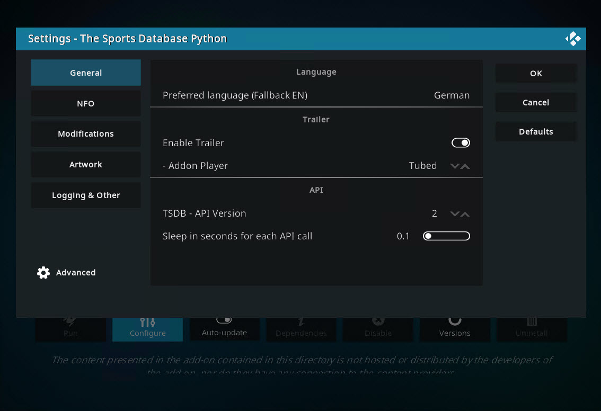
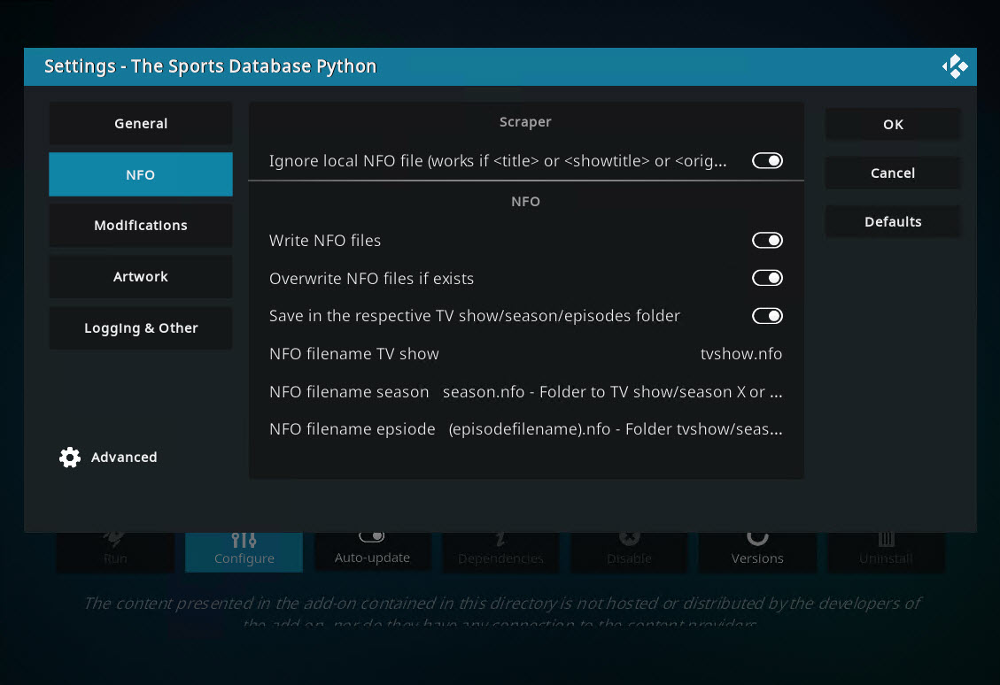

> [!NOTE]
> Support us on Patreon: <a href="https://patreon.com/ProjectKodi">patreon.com/ProjectKodi</a>

# Project Kodi - The Sports Database Pyhton
## metadata.thesportsdb.python

<ul>
    <li>File naming tools for Sports Database: <a href="https://www.tinymediamanager.org/">TinyMediaManager</a> | <a href="https://gitlab.com/tinyMediaManager">TinyMediaManager - Gitlab</a> (and yet not supported: Media Companion, MediaElch, Radarr, Sonarr, Jellyfin,.. help and contact the software manufacturers!)</li>
    <li>Kodi Forum: The Sports Database Pyhton - (metadata.thesportsdb.python): <a href="https://forum.kodi.tv/showthread.php?tid=368208">TheSportsDB Python Scraper (for Nexus and Later)</a></li>
    <li>Download: Use the Project Kodi Repository in Kodi: <a href="https://project-kodi.github.io/">https://project-kodi.github.io/</a></li>
    <li>Download Example Files: <a href="https://raw.githubusercontent.com/Project-Kodi/Project-Kodi.github.io/main/Information/The%20Sports%20Database%20Python%20-%20metadata.thesportsdb.python/File%20Naming%20%26%20Tools/Example%20files%20for%20naming/Example%20files%20for%20naming.zip">Example files for naming.zip</a></li>
  </ul>
  

Github Source: <a href="https://github.com/Project-Kodi/Project-Kodi.github.io/tree/main/Information/The%20Sports%20Database%20Python%20-%20metadata.thesportsdb.python">https://github.com/Project-Kodi/Project-Kodi.github.io/tree/main/Information/The%20Sports%20Database%20Python%20-%20metadata.thesportsdb.python</a>
  
  

# Documentation

- Addon Download and Installation

- Addon Settings

- Addong Using

## Addon Download and Installation

### 1. Install - Project-Kodi Repository

	<ul>
		<li>Go to the Kodi file manager.</li>
		<li>Click on "Add source".</li>
		<li>The path for the source is: <code>https://Project-Kodi.github.io/</code> (Give it the name "Project Kodi Repository").</li>
		<li>Go to "Addons".</li>
		<li>In addons, install an addon from zip.  When it asks for the location, select "Project Kodi Repository", and install <a href="repository.project.kodi-1.0.1.zip">repository.project.kodi-1.0.1.zip</a>.</li>
		<li>Now the repository is available in Kodi.</li>
		<li>Additionally, you should turn on automatic updating: Go to “Addons”, select “User Addons”, then “Addon Repository”, select “Project Kodi Repository” and activate automatic updating.</li>
	</ul>

### 2. Install - The Sports Database Addon

	<ul>
		<li>Go to "Addons", select "Install from repository".</li>
		<li>Select the "Project Kodi Repository".</li>
		<li>Go to Information provider, tv information and choose The Sports Database Python</li>
	</ul>

## Addon Settings

### Addon Settings - General 

- Language

- Trailer

- API

### Addon Settings - NFO

- Scraper

- NFO

### Addon Settings - Modifications 

- Title

### Addon Settings - Artwork 

- TVShows

- Seasons

- Character Art (Player)

### Addon Settings - Logging & Other

- Logging

- Premium 

- Support

## Addong Using

### Addong Using - xyz 

bla bla

### Addong Using - dsa 

bla bla

### Addong Using - qwe 

bla bla

:+1: thank you for reading! :shipit:

> [!TIP]
> Support us on Patreon: patreon.com/ProjectKodi

